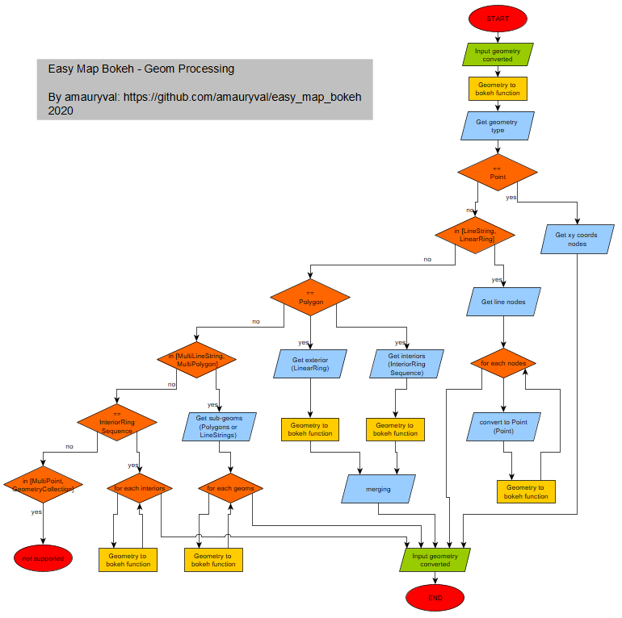

# easy_map_bokeh
An easy way to map your geographic data (from a GeoDataFrame) with [bokeh >=__2.0.1__](https://github.com/bokeh/bokeh/tree/2.0.1)
Because it's boring to convert shapely geometry to bokeh format !!


[](https://codecov.io/gh/amauryval/easy_map_bokeh)

[](https://anaconda.org/amauryval/easy_map_bokeh)
[](https://anaconda.org/amauryval/easy_map_bokeh)

[](https://anaconda.org/amauryval/easy_map_bokeh)

[](https://conda.anaconda.org/amauryval)


## How to install the conda package ?
Install Anaconda

then on your terminal:
```
conda install -c amauryval easy_map_bokeh
```


## How to use it ?!

A small example :

Check bokeh documentation in order to style your data :
    
* [bokeh marker style options](https://docs.bokeh.org/en/latest/docs/reference/models/markers.html) to style point features
* [bokeh multi_line style options](https://docs.bokeh.org/en/latest/docs/reference/plotting.html?highlight=multi_polygons#bokeh.plotting.figure.Figure.multi_line) to style LineString and MultiLineString features
* [bokeh multi_polygon style options](https://docs.bokeh.org/en/latest/docs/reference/plotting.html?highlight=multi_polygons#bokeh.plotting.figure.Figure.multi_polygons) to style polygon and multipolygons features

```python
from bokeh.plotting import show
import geopandas as gpd
from easy_map_bokeh import EasyMapBokeh

layers_to_add = [
    {
        "input_gdf": gpd.GeoDataFrame.from_file("your_geo_layer.geojson"),
        "legend": "My beautiful layer",  # required
        "fill_color": "orange",  # here we found one argument use by bokeh to style your layer. Take care about geometry type
    }
]
# Points, LineString, MultiLineString, Polygons (+ holes) and MultiPolygons (+ holes) are supported

my_map = EasyMapBokeh(
    "My beautiful map",  # required: map title
    width=800,  # optional: figure width, default 800
    height=600,  # optional: figure width, default 600
    x_range=None,  # optional: x_range, default None
    y_range=None,  # optional: y_range, default None
    background_map_name="CARTODBPOSITRON",  # optional: background map name, default: CARTODBPOSITRON
    layers=layers_to_add    # optional: bokeh layer to add from a list of dict contains geodataframe settings, see dict above
)
# to get all the bokeh layer containers (dict), in order to update them (interactivity, slider... on a bokeh serve)
bokeh_layer_containers = my_map.get_bokeh_layer_containers

show(my_map.figure)
```

Check the jupyter notebook to find a more detailed example: 
```
jupyter notebook
```
And open 'example.ipynb'

OR click on this [link](https://amauryval.github.io/easy_map_bokeh/)


Also, you can find a bokeh serve example with a slider widget.
On the terminal, run :
```
bokeh serve --show bokeh_serve_example.py
```

## Process

The main feature is about the shapely geometry conversion to bokeh format. The next figure try to describe the process


